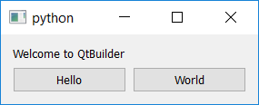
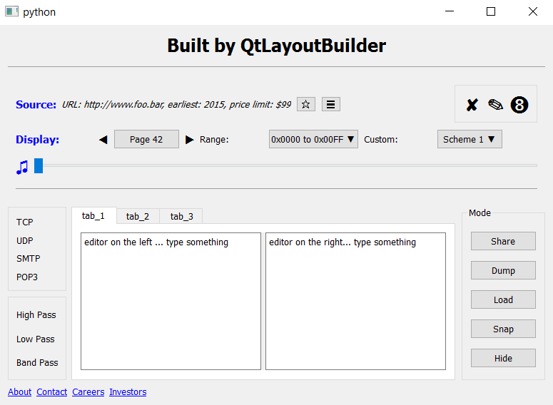

# qtlayoutbuilder

### Quick Summary

A python library that works with PyQt or PySide to make it **very**
much quicker and easier to develop (and evolve) GUIs.

##### Key Goals:
- Fast workflow for the developer
- Instant feedback
- Make layouts easier to change
- Operate at runtime; no compile+integrate steps
- Direct, programmatic access to all objects created
- Practical to introduce to existing code, step by step
- No interference with standard Qt workings

#### Making a Real Simple GUI

    from qtlayoutbuilder.api.build import build_from_multi_line_string
    
    layouts_created = build_from_multi_line_string("""
        top_widget            QWidget
          rows                QVBoxLayout
            greeting          QLabel(Welcome to QtBuilder)
            some_buttons      QHBoxLayout
              button_a        QPushButton(Hello)
              button-b        QPushButton(World)
    """)
    layouts_created.at('my_page').show()

#### A More Realistic Example

You can see the input file for this GUI
[here](testdata/big_example_for_manual.txt).

#### Instant Feedback

#### Getting started

