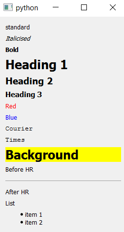

# Qt Layout Builder - User Manual

- [Getting Started](#getting-started-example)
- [The Input Text](#anatomy-of-the-input-text)
- [Parent Child Relationships Supported](#parent--child-relationships-supported)
- [Setting the Text on Things](#setting-the-text-on-things)
- [Taking Input From a File](#taking-the-input-from-a-file)
- [Auto Formatting](#auto-formatting)
- [Error Handling](#error-handling)
- [Comments](#comments)
- [Using Objects You Instantiated Externally](#using-objects-you-instantiated-externally)
- [Incomplete or Multiple Hierarchies](#incomplete-or-multiple-hierarchies)
- [Instant Feedback During Development](#instant-feedback-during-development)
- [Limitations](#limitations)
- [Cautionary Notes](#cautionary-notes)

## Getting Started Example

    from PySide.QtGui import QApplication
    from qtlayoutbuilder.api import Builder
    
    Builder.build_from_multi_line_string("""
    top_widget            QWidget
      rows                QVBoxLayout
        greeting          QLabel(Welcome to QtBuilder)
        some_buttons      QHBoxLayout
          button_a        QPushButton(Hello)
          button_b        QPushButton(World)
    """)
    
    # Access the objects created like this...
    hello = layouts.at('button_a')
    
    app = QApplication()
    layouts.at('top_widget').show()
    app.exec_()
    
       
This example creates a QWidget (which it refers to as *top_widget*), and then 
sets its layout to be a *QVBoxLayout*. Then it populates that layout with 
two items, which it refers to as *greeting*, and *some_buttons*. The item 
called greetings is a QLabel, and has its text set to 'Welcome to QtBuilder'.
The item called 'some_buttons' is a QHBoxLayout, which is populated with two
QPushButtons.

The example also shows how you can access the objects created afterwards.

## Anatomy of the Input Text
Each line of input creates an object of the type specified by the second word,
and provides the builder with a name to associate with it. The indentation of 
the name words specifies the parent-child hierarchy that the builder will 
create. Children are indented in relation to their parents by two spaces.

The indented alignment of the *name* words is of central importance. But there
is no significance in the alignment of the *type words*. They are lined up in
the example solely for readability. (See later section on auto-formatting)

## Parent / Child Relationships Supported
The builder does more to create parent-child relationships, than 
just adding things to layouts. It can:
- Set the layout for a widget.
- Set the text content on some widgets
- Add tabs to tab widgets
- Set the widget for a scroll area
- Add a spacer item to a Q*BoxLayout

The full capabilities for adding children to parents are as follows:

### Creating the Standard Qt Widget/Layout Hierarchy
First the builder, uses the methods required to create the standard hierarchy
of layouts and widgets.

- addWidget(child) # Add a widget into a parent layout
- addLayout(child) # Add a sub-layout to parent layout
- setLayout(child) # Set the layout for a parent widget

For each line of input, the builder calls these methods speculatively on the 
parent object, and stops at the first one that works.
(Doesn't raise an exception)

If none of the above worked, the builder then tries a few more methods 
speculatively, and again stops at the first one that works. These are intended 
for some very common special cases, as follows. 
    
### Adding a QSpacerItem to a Q*BoxLayout
The builder tries calling addSpacerItem(child).
You use it like this:

    horiz       QHBoxLayout
      label1    QLabel('foo')
      spacer    QSpacerItem
      label2    QLabel('bar')
     
The builder constructs the QSpacerItem with zero horizontal and vertical sizes,
but with an *Expanding* size policy, which makes it exactly equivalent to the 
very commonly used *addStretch()* method on a Q*BoxLayout.
 
### Adding a QWidget to a QTabWidget
The builder tries calling addTab(child).
You use it like this:

    tab_widget          QTabWidget
      tab_a             QWidget
      tab_b             QWidget
      tab_c             QWidget
      
The builder names the tabs sequentially: tab_1, tab_2, ... tab_n
 
### Setting the widget for a QScrollArea
The builder tries calling setWidget(child).
You use it like this:

    scroller            QScrollArea
      content           QWidget
      
The builder also calls setWidgetResizable(True) on the QScrollArea.
(Because they work rather unintuitively otherwise).

### Omitted Special Cases
There are some parent child relationships that the builder cannot make
completely automatically for you, because it can't guess all the parameters
required by the addition methods. An example would be adding the children 
to a QGridLayout - where the builder cannot guess which rows and columns to 
specify.

> We could have extended the input file syntax to deal with some of these
> cases - but preferred to preserve the very simple, and quick to learn 
> syntax.

All is not lost however - see the later section about *Incomplete 
Hierarchies* below.

## Setting the Text on Things
Anytime you put some text in parenthesis after a type word like this:

    label1      QLabel(some text)
    
The builder will try to give that text to the object created, first by trying
to call setText(), and then with setTitle().

(Good for QLabel, QPushButton, QLineEdit, QGroupBox and possibly other classes).

### Fonts, Colours, and Text Size

Qt let's you control the font, colour and size of your text on widgets like
QLabel, QTextEdit etc, with HTML 4 in-line style markup in the call to 
*setText()* : http://doc.qt.io/qt-4.8/richtext-html-subset.html

Which means you can simply include your markup in the text you put in parenthesis:

    h1              QLabel(<h1>Heading 1</h1)
    h2              QLabel(<h2>Heading 2</h2)

### Using Symbols and Icons on Buttons and Labels
The strings used by QLabels, QPushButtons etc. are Unicode. And Unicode 
includes a very wide variety of symbols and graphical icons.

**Unicode Symbol References:**

https://en.wikipedia.org/wiki/Miscellaneous_Symbols

http://unicode.org/charts/#symbols 

These typographic symbols (glyphs) render very much more crisply, and 
scale better than 
image-based icons, (because of the anti-aliasing of edges built-in by the
font designers). They also remove the need to manage and deploy image resources.

You can include Unicode characters (or more properly *code-points*) in your
builder input, using the same notation as you would if you were writing a
string literal in Python source code. Like this example which puts the *pencil*
symbol on a button:

    button      QPushButton(\u2709)
    
Or this example that includes the symbol for *return* or *enter* in the middle
of a label:

    label       QLabel(Press \u23ce when done.)
    
> Qt does not support rich text (and thus the in-line html4 markup) for 
> QPushButton and QToolButton, so if you want to alter the size, and font etc.
> for symbols used on buttons, you have to use setStyleSheet() manually.

Some Unicode symbols have *code-points* above 0xFFFF, and you can encode these
again, just like in Python source code. Note the upper case U and 8 instead of
4 ascii characters following. This example is a hamburger symbol. (Not the 3-bar
hamburger menu - but a **real** hamburger!)

    label       QLabel(\U0001F354)
   
> Using Unicode in text in Qt is dependent on a suitably equipped font being
> available on the runtime machine.

> A very convenient font that includes a wide range of symbols for Windows is 
> 'Lucida Sans Unicode' because it has been installed by default for all 
> versions of Windows since Windows 98. To get the widest possible symbol
> support try the open-source Code2000 font. 

You can specify the font from the builder like this:

    courier         QLabel(Courier)

    
Or of course, you can do it programmatically afterwards by calling 
*setStyleSheet()* on the widget (or parent).
   
## Taking the Input From a File

    layouts = Builder.from_file(file_path)
    
## Auto Formatting
When you use the build-from-file option, the builder will automatically 
re-format your file (in-place) to line up the right hand column, so you don't
have to waste effort on doing it (or changing it) manually. It creates a backup
each time - and adds a comment to the file about where the backups are saved.

To turn this behaviour off:

    layouts = Builder.from_file(file_path, auto_format_and_overwrite=False)
    
Auto formatting is not turned on by default for the multiline string variant of 
the API call; largely because there is nowhere obvious for the builder to 
write the reformatted version to. You can turn it on however by specifying a 
file it should write to:

    Builder.build_from_multi_line_string(
        'the string', auto_format_and_write_to='my_file.txt')
    
## Error Handling
The builder handles all errors by raising an api.LayoutError which contains
an explanation, and the offending line number from the input.

    try:
        Builder.xxx()
    except LayoutError as e:
        print str(e)

## Comments

A comment line is a line in which the first non-space character is a hash.
The whole of that line will be ignored by the builder. 

    # I am a comment
    layouts = Builder.build_from_multiline_string("""
        my_page             QWidget
                            # I am a comment also
          layout            hbox
          
## Using Objects you Instantiated Externally
The builder can incorporate objects you have instantiated somewhere else in 
your code into the layout hierarchies it makes. This is useful for objects with
more complex construction needs, and when introducing the builder incrementally
to existing code.

    my_widget      ?CustomWidget
    
This syntax will make the builder introspect your running code to find an object
of the *CustomWidget* class (or subclass), that you have **already** 
instantiated in your program and referred to with a variable called *my_widget*, 
or an attribute called *my_widget*. For example:

    my_widget = CustomWidget(), or
    something.my_widget = CustomWidget()
    
> The builder finds the object you are referring to with the help of Python's 
> Garbage Collector - which knows about every object that exists in your program.

Nb. It raises an error if it finds more than one object that qualifies.
## Incomplete or Multiple Hierarchies

You can build multiple, (unrelated) hierarchies like this:

    page1        QWidget
      layout1    QVBoxLayout
      etc...
    page2        QWidget
      layout2    QVBoxLayout
      etc...
      
This can be useful to make some QDialogs that you are going to bring up
independently. Or when the builder cannot create the whole tree you want 
because it includes an item that the builder cannot add children to. (Like 
QGridLayout for example.) You can create separate hierarchies for the 
children and then add them manually afterwards. E.g.

    layouts = Builder.build_from_multiline_string("""
        page1       QWidget
          layout    QGridLayout
          # Cannot go any further because need row/column to add children :-(
      
        # We can still make the things to go into the grid.
        cell_widget QWidget
          layout    QVBoxLayout
            label1  QLabel(foo)
            label2  QLabel(bar)
            label3  QLabel(baz)
    """
    
    # And then access the objects to finish the job.
    grid = layouts.at('layout')
    cell = layouts.at('cell_widget')
    grid.addWidget(cell, 0, 1)
    
## Instant Feedback During Development
It is extremely useful to see instant feedback when you are editing input files
for the builder; which is what the **tools/helper_gui.py** tool is for.

It monitors every time you (or your editor) saves your input file, and 
immediately shows you the resultant GUI.

It also has a button to automatically reformat your input file in situ, to save
you having to bother to line up the right hand side.

**Usage**

    python helper_gui.py

    
## Limitations

These are the most common parent child relationships that the builder 
**cannot** make for you automatically:

- Cannot populate anything that has rows and columns
- Cannot populate QComboBox or QMenu
- Cannot populate the model-based widgets (like QListView)
- Doesn't deal with QMainWindow, Dockable Areas or Toolbars.
    
## Cautionary Notes
Qt itself lets you override the layout of all QWidgets, but when you are
programming layouts manually it's almost impossible to do so by accident. For
example, you wouldn't accidentally change the layout used by a QLabel in regular
code. Unfortunately you can do so accidentally rather easily with the builder's
input, like this:

    label       QLabel
      layout    QVBoxLayout
      
If you end up with layouts that have widgets bizarrely superimposed - this is the 
likely reason.
