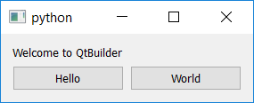

# qtlayoutbuilder

### Quick Summary

A python library that works with **PySide** to make it **VERY**
much quicker and easier to develop (and evolve) GUIs.

##### Key Goals:
- Faster workflow for the developer (than existing choices)
- Simple
- Instant feedback during development
- Make layouts easier to change
- Operate at runtime; no compile+integrate steps
- Direct, programmatic access to all objects created
- Practical to introduce piecemeal to existing code
- No interference with standard Qt workings

##### Licence
This project is licensed under the terms of the MIT license.

#### Making a Real Simple GUI

    from qtlayoutbuilder.api.build import build_from_multi_line_string
    
    layouts_created = build_from_multi_line_string("""
        top_widget            QWidget
          rows                QVBoxLayout
            greeting          QLabel(Welcome to QtBuilder)
            some_buttons      QHBoxLayout
              button_a        QPushButton(Hello)
              button-b        QPushButton(World)
    """)
    layouts_created.at('top_widget').show()

#### A More Realistic Example

You can see the input file for this GUI
[here](../testdata/big_example_for_manual.txt).

#### Instant Feedback
QtLayoutBuilder comes with a tool to give you instant feedback while
you are editing input files during development.

It monitors every edit you make to your input file, and shows you the 
result immediately like this (below) without you having to leave 
your editor or do anything. 

#### Getting started

[User Manual](../docs/user_manual.md)

